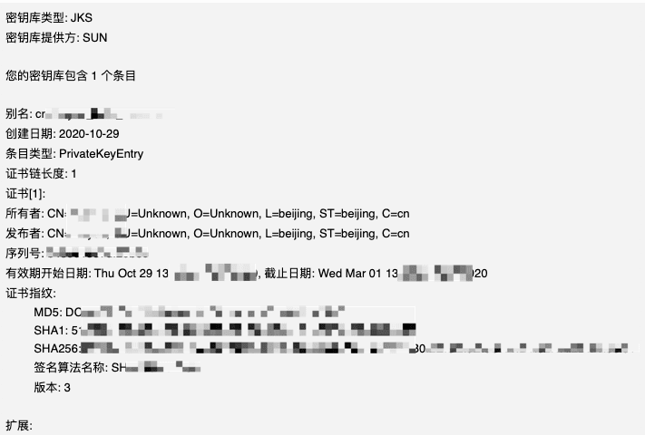
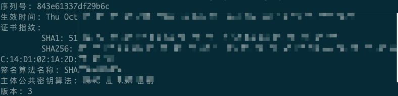
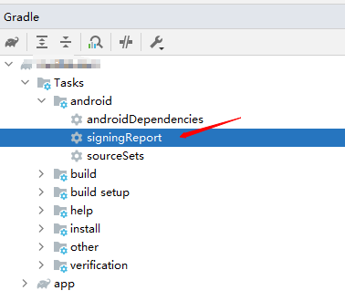

# 使用keytool无法查看MD5签名

> 前两天申请微信相关sdk，需要用到Android证书的md5签名，挺简单的事情还是经历了点波折，特意记录下。

正常来说，我们查看Android证书签名会使用如下命令：
```
#xxx.jks替换成自己的签名文件
keytool -v list -keystore xxx.jks
```

然后按照正常的结果，应该如下图：



但实际上结果却是...



发现了没，结果中没有MD5签名，emo...中，怎么回事，以前都是这样做的，经过10几分钟的百度，google大概知道原因了，高版本jdk不再支持该指纹的获取了，知道原因了，那问题就好解决了，下面列出3种解决方案：

### 方案一：jdk降级

重新下载一个低版本的jdk(我这里使用的是jdk8，**之后的版本都不支持**)，使用上面的命令，还是能获取到md5。但作为技术宅的我们，一般不想去下载那么多的版本，那么方案二就来了。

### 方案二：用openssl转换生成md5

openssl没有，怎么安装，这个不在本文范围，请自行百度...

那么如何通过openssl转换呢？

请参考如下命令：

```
#在命令行输入
keytool -exportcert -alias poem -storepass testpass -keystore poem.keystore | openssl dgst -md5
#结果如下(不带冒号)
(stdin)= 1b2828dd49b64ba5bf1424cfed983019
```

这个看着是不是不太熟悉，不是我们要的md5的样子，那么变下样式，如下

```
#使用正则给md5加冒号
keystore]$ keytool -exportcert -alias poem -storepass testpass -keystore poem.keystore | openssl dgst -md5 | sed 's/[a-fA-F0-9][a-fA-F0-9]/&:/g; s/:$//'
#这样，结果就有冒号了，是不是熟悉的样子
(stdin)= 1b:28:28:dd:49:b6:4b:a5:bf:14:24:cf:ed:98:30:19
```

嗯~~~没安装openssl，对openssl不熟悉，咋个办...

### 方案三：signingReport

这又是什么科技....

作为一个Android搬砖崽，看着这个是不是有点熟悉的样子，对的，就是gradle命令，如何使用该命令呢。

方式一：
```
#mac或linux
./gradlew signingReport

#windows
gradlew.bat signingReport
```

方式二：

有安装AndroidStudio吧，如下图：



> 注意：上述使用方式均需要再项目中配置签名，就是你项目的build.gradle文件