## 应用上架<!-- {docsify-ignore} --> 

### Google商店

#### 前期准备<!-- {docsify-ignore} --> 

1. [google开发者账号](https://play.google.com/console/u/0/signup)
2. [App Bundle文件](https://developer.android.com/guide/app-bundle?hl=zh-cn#get_started):
3. 512*512像素的App Logo
4. 1024*500像素的置顶大图
5. 4张以上App的屏幕截图
6. 隐私协议和应用网站地址

#### 注册Google开发者账号<!-- {docsify-ignore} --> 

国内开发者注册Google账号，必须科学上网或者使用国外IP登录才行

1. 登录[Google网站](https://accounts.google.com/signup/v2/webcreateaccount?service=androiddeveloper&continue=https%3A%2F%2Fplay.google.com%2Fapps%2Fpublish%23&gmb=exp&biz=false&flowName=GlifWebSignIn&flowEntry=SignUp)
2. 填写相关信息，注意：填写的信息要用拼音或英文，不能用汉字

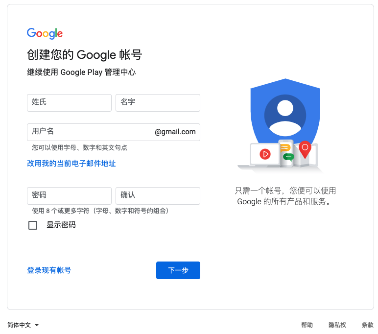

3. 点击下一步，验证手机号
4. 完成后，勾选同意隐私条款，Google账号即可创建成功
5. 登录[Google play console](https://play.google.com/console/u/0/signup),填写公开开发者名称等信息（此信息后续可随时更改），同意协议并创建账号,升级为Google开发者账号

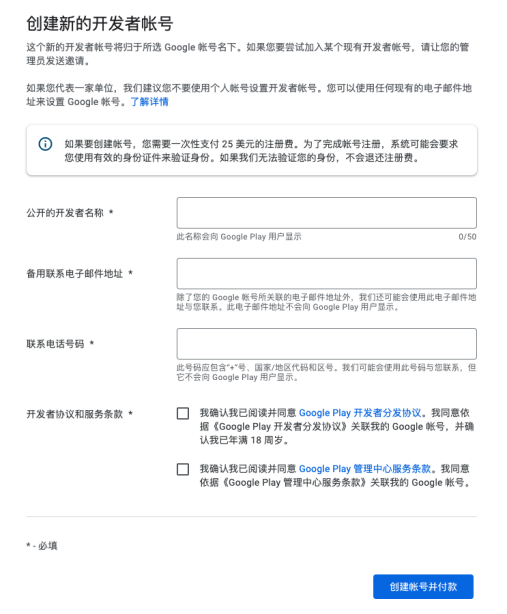

6. 需支付25美金用于创建Google开发者账号的，Google账号只能使用Visa、Master、JCB、运通卡或Discover（国内用户建议使用招商的信用卡，其他行的支付有时会不成功），只需支付一次，即可永久使用

> 注意事项
> 1. 完成账号注册后，Google需要审核账号情况，预计1天左右时间，请随时查看邮箱关注动态 
> 2. 请珍惜自己的开发者账号，遵守Google开发者协议，如因违反协议导致封号，将不会解封，且影响已上架的所有App
开发者政策中心网址：
https://play.google.com/about/developer-content-policy/#!?modal_active=none
> 3. 如果需要多个开发者账号，建议使用不同的信用卡进行支付，并且两个账号尽量不要在同一IP下进行登录，防止一个账号因异常被封停导致另一个也被关联封停。

#### 创建应用<!-- {docsify-ignore} --> 

1. 使用注册好的google开发者账号登录 [Google Play Console](https://play.google.com/console/signup)
2. 点击 **创建应用**

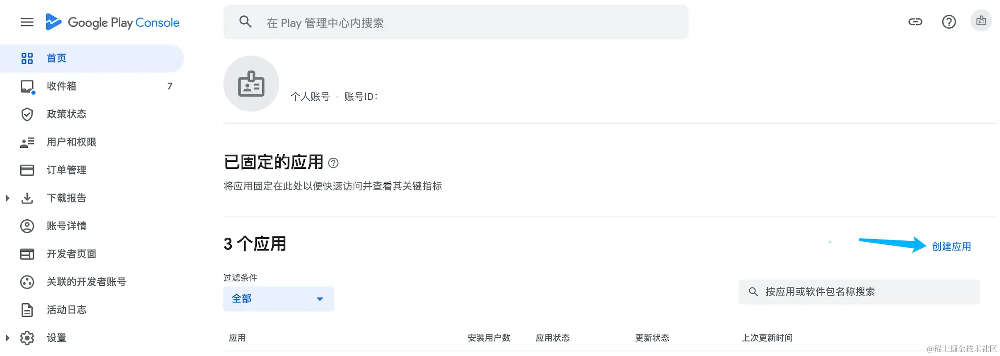

3. 填写 应用名称，选择默认语音，签署声明，并点击右下角的 **创建应用**

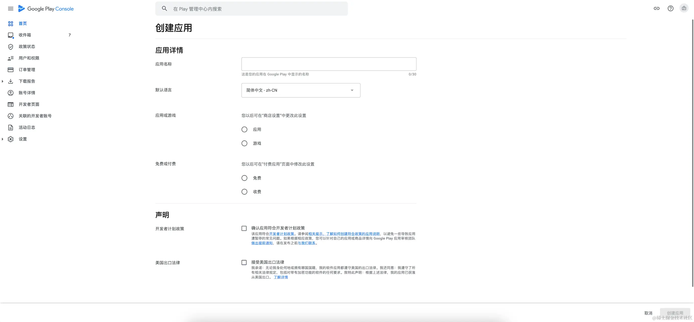

#### 设置应用<!-- {docsify-ignore} --> 

在 Google Play Console 左侧导航栏 选择 信息中心，提供了完善的上架流程指南。

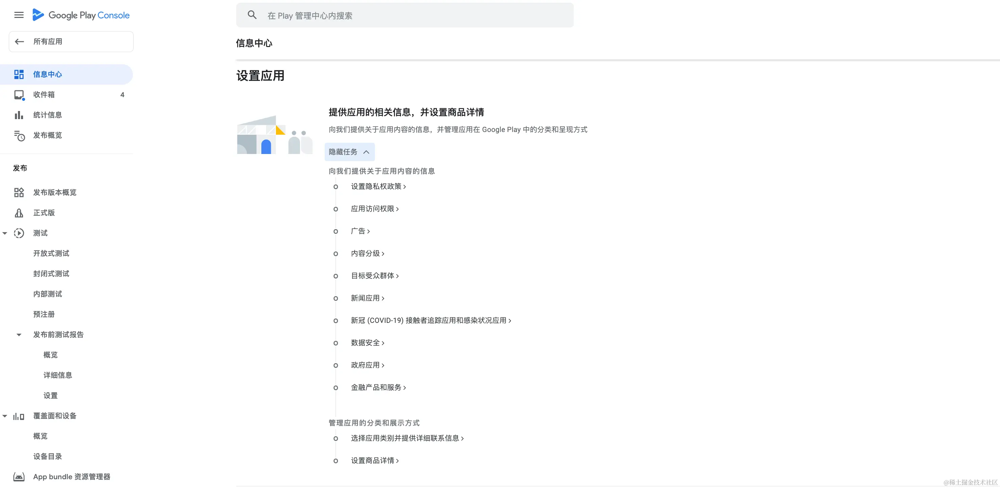

1. 在 左侧导航栏 选择 应用内容 ，并开始根据App实际情况 签署声明。

- 隐私权政策：填写App 隐私协议 地址。
- 广告：广告政策
- 应用访问权限：为了审核App，Google Play 必须能够访问应用的所有部分。（如用户名和密码、会员和订阅等）。
- 内容分级：声明应用内容分级，填写电子邮箱，以便Google Play团队联系。
- 目标受众群体和内容
- 新闻应用：新闻类应用，需要额外遵守 Google Play 的 “新闻”政策。
- COVID-19应用
- 数据安全
- 广告 ID：应用是否使用了广告 ID
- 政府应用
- 金融产品和服务

完成 应用内容 的所有必要声明后，在 左侧导航栏 选择 发布概况 ，将所有 已可送审的更改内容 送审。更改必须先经过 Google 批准，然后才能发布。

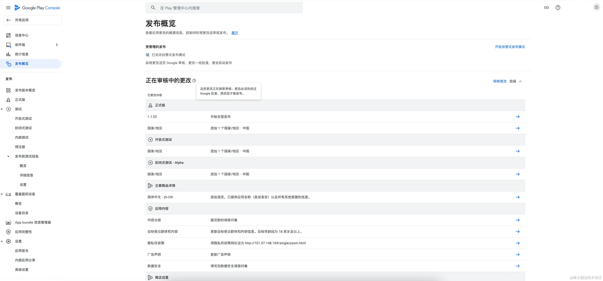

2. 商店设置

在 左侧导航栏 选择 商店设置 ，设置 App 在 Google Play 上所属的 类别，标签 以及面向用户提供的 详细联系信息。

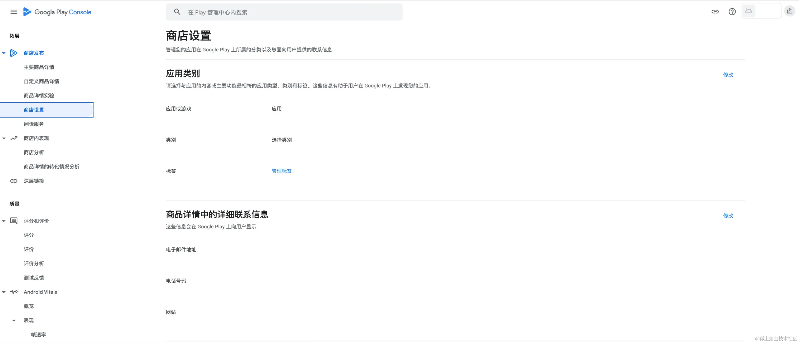

3. 设置商品详情

商品详情为应用打造出色的第一印象，让用户更容易发现并使用你的应用。修改应用的名称、图标、说明、屏幕截图和视频等信息，提高应用曝光度和下载量。

在 左侧导航栏 选择 主要商品详情 保存设置。

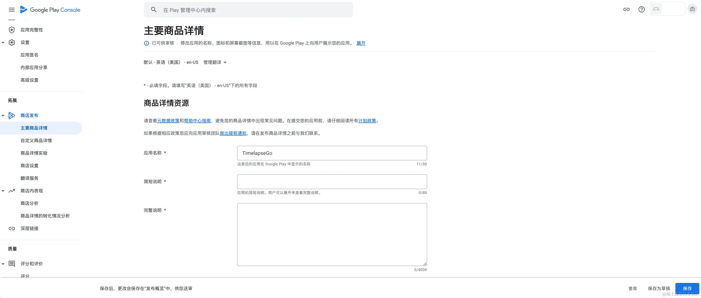

| 图片      | 要求 |
| :----------- | :----------- |
| 应用图标      | 32 位 PNG，尺寸 512 * 512 像素，文件大小上限 1024 KB       |
| 置顶大图   | JPEG 或 PNG，尺寸 1024 * 500 像素        |
| 手机屏幕截图   | JPEG 或 PNG，每张大小不得超过 8 MB，宽高比为 16:9 或 9:16，各条边的尺寸介于 320 像素和 3840 像素之间，每个方向都不低于 1080 像素        |
| 7英寸平板屏幕截图   | JPEG 或 PNG，每张大小不得超过 8 MB，宽高比为 16:9 或 9:16，各条边的尺寸介于 320 像素和 3840 像素之间，每个方向都不低于 1080 像素        |
| 10英寸平板屏幕截图   | 	JPEG 或 PNG，每张大小不得超过 8 MB，宽高比为 16:9 或 9:16，各条边的尺寸介于 1080 像素和 7680 像素之间，每个方向都不低于 1080 像素        |
| 预览视频（可选）   | 输入 YouTube 网址，就可以向商品详情添加预览视频        |

#### 发布应用<!-- {docsify-ignore} --> 

将 App 发布至 Google Play。在 左侧导航栏 选择 正式版。

1. 选择国家和地区

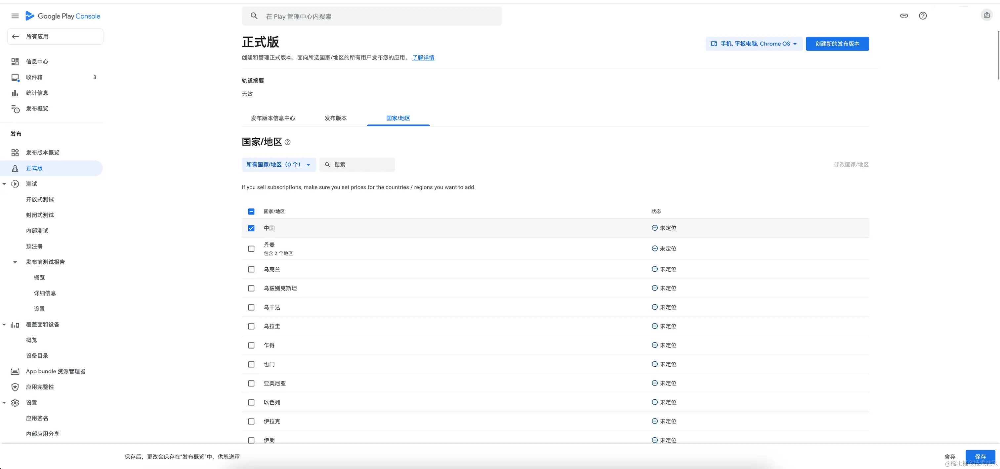

2. 创建发布版本

点击右上角 创建新的发布版本，开始发布应用。

3. 选择签名密钥

首先 Google 生成的应用签名密钥无法下载，将完全由 Google Play 进行 二次签名 服务。这也就意味着，其他渠道的App 无法与 Google Play 市场的App使用相同签名，同时App发布之后的 SHA-1、SHA-256 和 MD5 散列值都会发生变化！！！

~~当然也可以选择提供 签名密钥 给 Google Play 签名。这里自行取舍~~(**个人不建议**)。

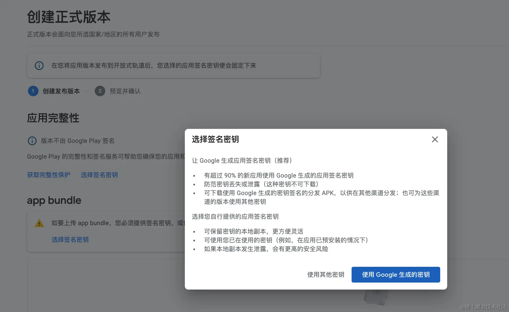

4. 上传App bundle

从 2021 年 8 月起，新应用需要使用 Android App Bundle，才能在 Google Play 中发布。现在，Play Feature Delivery 或 Play Asset Delivery 支持大小超过 200 MB 的新应用。 从 2023 年 6 月开始，全新和现有 TV 应用均须以 App bundle 形式发布。

Android App Bundle 是一种发布格式，其中包含您应用的所有经过编译的代码和资源，它会将 APK 生成及签名交由 Google Play 来完成，详细信息。

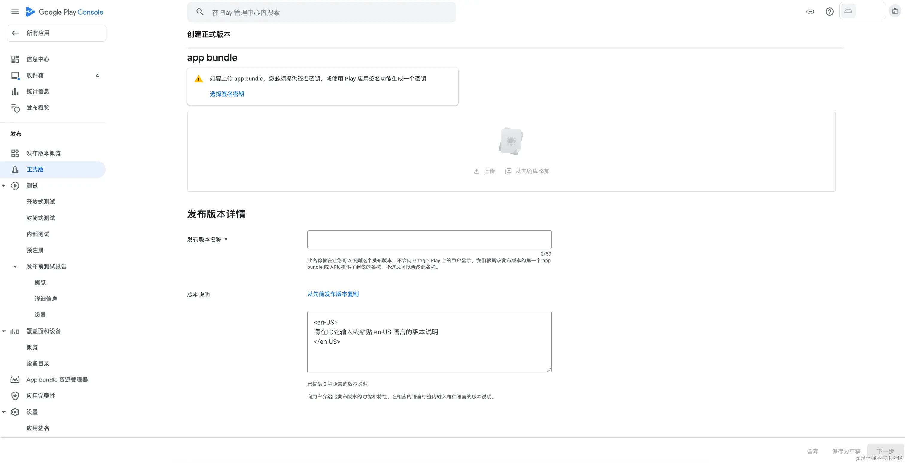

同时App还需要满足 Google Play 的 目标 API 级别要求。在每年的 8 月 31 日之前，完成对 目标 API 级别 的调整。

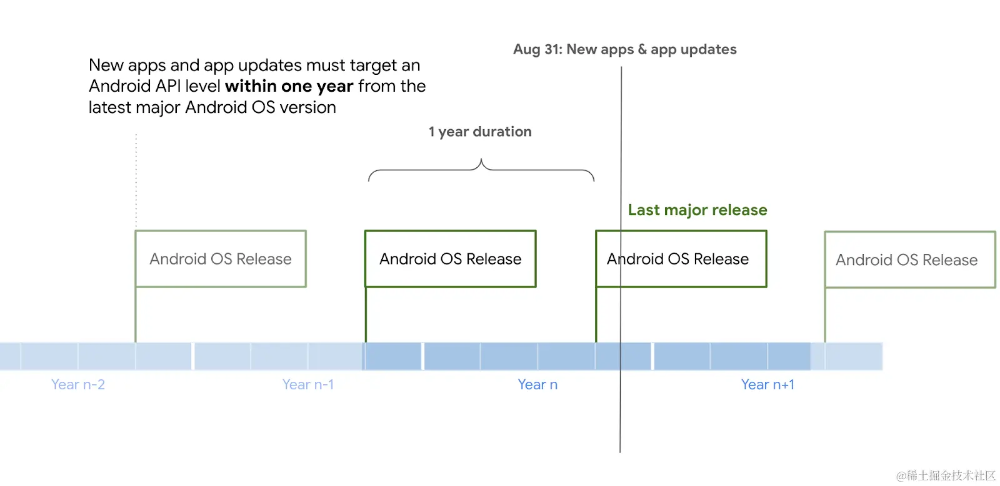

5. 设置发布版本详情：完成本次 发布版本名称 以及 版本说明，并点击 下一步。

6. 预览并确认发布

正式发布后，Google play会对 App 进行自动审核，一般审核时间在 1-7 天左右，如果选择关闭自管式发布模式审核通过
后会自动上架应用市场，反之如果你开启自管式发布模式，审核通过后需要手动确认发布，App会在几分钟内上架应用市场。我们可以在 发布版本预览 里看到版本最新的状态。

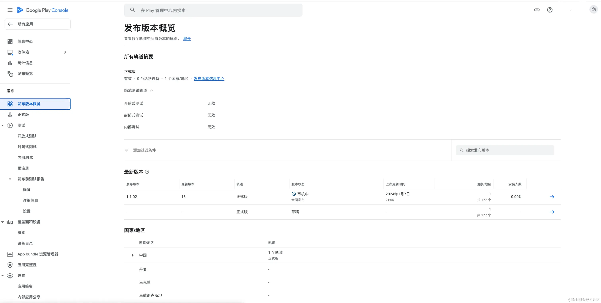

#### Flutter上架Google Play相关问题<!-- {docsify-ignore} --> 

1. 签名问题

应用传到google后台后，会弹出一个选择签名的弹窗，别使用 **使用Google生成的密钥** 这个，点击 **使用其他密钥**，就不会有事，选了可能会造成签名不一致，一些第三方无法使用。

2. 登录问题

Google开发者账号在哪个机器注册的，后续就在对应的机器上架，尽量别用不同机器登录同一个Google账号；也不要在同一个设备上登录多个Google账号。

