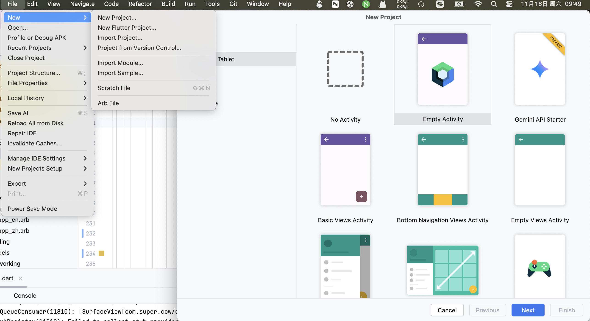

> 工欲善其事，必先利其器

一门技术的开始，肯定是从搭环境开始，了解这门技术需要用到哪些工具，使用这些工具跑通最简单的Demo，下面我们以Mac电脑来讲解下Android开发环境的搭建，本文分以下几个步骤：

> 如果在下面相关地址进不去，可能是网址被墙了，需要[科学上网](科学上网.md)或使用国内相关镜像

### 软件下载

1. AndroidStudio：[官网地址](https://developer.android.com/studio?hl=zh-cn)，如果只需要运行项目，不适用命令行等其他工具，新版本的开发工具中以及集成了JDK和SDK，可以直接使用，但建议另外下载JDK和SDK，方便管理
2. JDK：[官网地址](https://www.oracle.com/java/technologies/downloads/#java11?er=221886)
3. AndroidSDK：[官网地址](https://developer.android.com/studio?hl=zh-cn#downloads) 

### 环境变量配置

1. 打开终端，使用vim打开配置文件.zshrc

```
vim ~/.zshrc
```

2. 下载完上面的软件后，解压安装，记住jdk和sdk解压路径，配置环境变量

```
# AVA_HOME目录根据自己解压目录做调整，这里的版本号根据您的JDK版本而定
export JAVA_HOME=`/usr/libexec/java_home -v "11.0.1"` 
export PATH=$JAVA_HOME/bin:$PATH
#ANDROID_HOME目录根据自己解压目录做调整
export ANDROID_HOME=/Users/l3/Library/Android/sdk
export PATH=$ANDROID_HOME/platform-tools:$PATH
export PATH=$ANDROID_HOME/tools:$PATH
export PATH=$ANDROID_HOME/tools/bin:$PATH
```

3. 输入并保存好后，在终端输入source ~/.zshrc 刷新环境变量

```
source ~/.zshrc
```

### 检查环境

1. jdk环境检查：打开终端(Windows打开cmd命令窗口)，输入命令 java --version，能输出对应版本结果，则说明环境没问题

```
//输入命令
l3@L3deMacBook-Pro ~ % java --version
//输出结果
java 23 2024-09-17
Java(TM) SE Runtime Environment (build 23+37-2369)
Java HotSpot(TM) 64-Bit Server VM (build 23+37-2369, mixed mode, sharing)
```

2. sdk环境检查：打开终端(Windows打开cmd命令窗口)，输入命令 adb --version，能输出对应版本结果，则说明环境没问题

```
//输入命令
l3@L3deMacBook-Pro ~ % adb --version
//输出结果
Android Debug Bridge version 1.0.41
Version 35.0.2-12147458
Installed as /Users/l3/Library/Android/sdk/platform-tools/adb
Running on Darwin 24.0.0 (x86_64)
```

3. AndroidStudio环境检查，如下图：


### 新建项目并运行



如上图，点击AndroidStudio菜单栏File->New，选择Empty Module，点击Next，输入对应包名，版本，使用语言后完成，新建好一个最简单的项目，待编译完成后，点击界面中的三角形，如下图：


运行，这个时候如果没连接设备，会提示你去新建模拟器，有条件的可以连接真机，能成功在模拟器或真机上运行项目，说明环境搭建成功

### 注意事项

1. 在项目新建完成后，编译项目，可能会遇到依赖下载不下来，这里可能需要使用到国内镜像，在项目的根目录找到build.gradle文件，设置阿里镜像源，如下：

```
buildscript {
    ext.kotlin_version = '1.7.10'
    repositories {
        maven { url "https://maven.aliyun.com/repository/public" }
        maven { url 'https://maven.aliyun.com/repository/google' }
        maven { url 'https://maven.aliyun.com/repository/jcenter' }
        maven { url 'https://maven.aliyun.com/nexus/content/groups/public/' }
        maven { url 'https://www.jitpack.io' }
        google()
        mavenCentral()

    }

    ...
}

allprojects {
    repositories {
        maven { url "https://maven.aliyun.com/repository/public" }
        maven { url 'https://maven.aliyun.com/repository/google' }
        maven { url 'https://maven.aliyun.com/repository/jcenter' }
        maven { url 'https://maven.aliyun.com/nexus/content/groups/public' }
        maven { url 'https://www.jitpack.io' }
        google()
    }
}
```

2. 真机连接问题，第一需要打开开发者选项，一般都是进入手机应用设置->找到”关于手机“->手机信息中连续点击"软件版本"5到10次，即可打开，然后进入开发者选项打开”USB调试“开关，最后连接手机，通过命令adb device，查看手机是否连接上，也可以通过AndroidStudio界面看手机是否连接上。
