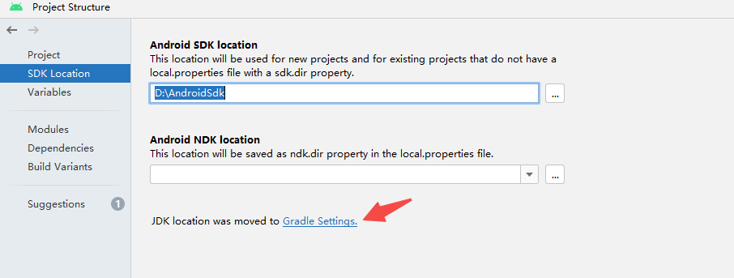
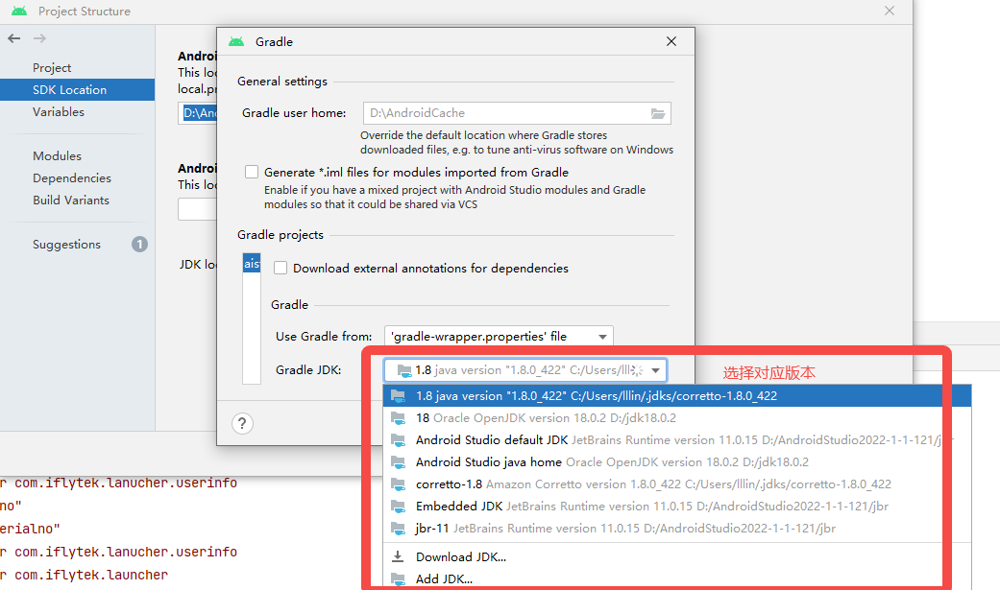
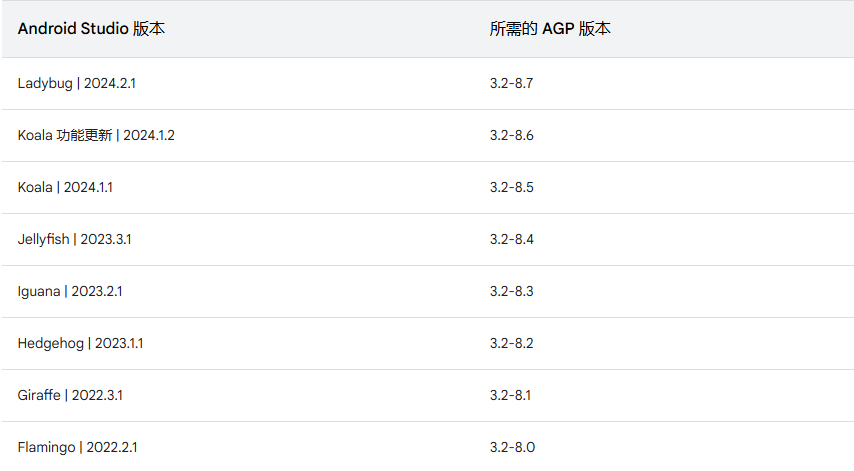
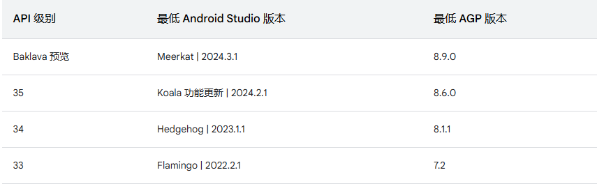

### 1. javax/xml/bind/JAXBException，完整信息如下：

```
java.lang.NoClassDefFoundError: javax/xml/bind/JAXBException
	at java.base/java.lang.Class.getDeclaredConstructors0(Native Method)
	at java.base/java.lang.Class.privateGetDeclaredConstructors(Class.java:3137)
	at java.base/java.lang.Class.getConstructor0(Class.java:3342)
	at java.base/java.lang.Class.newInstance(Class.java:556)
	at org.jetbrains.kotlin.cli.jvm.plugins.ServiceLoaderLite.loadImplementations(ServiceLoaderLite.kt:51)
	at org.jetbrains.kotlin.cli.jvm.plugins.ServiceLoaderLite.loadImplementations(ServiceLoaderLite.kt:44)
	at org.jetbrains.kotlin.kapt3.ClasspathBasedKapt3Extension$loadProcessors$efficientProcessorLoader$1.doLoadProcessors(Kapt3Extension.kt:84)
	at org.jetbrains.kotlin.kapt3.base.ProcessorLoader.loadProcessors(ProcessorLoader.kt:45)
	at org.jetbrains.kotlin.kapt3.base.ProcessorLoader.loadProcessors$default(ProcessorLoader.kt:28)
	at org.jetbrains.kotlin.kapt3.ClasspathBasedKapt3Extension.loadProcessors(Kapt3Extension.kt:89)
	at org.jetbrains.kotlin.kapt3.AbstractKapt3Extension.analysisCompleted(Kapt3Extension.kt:172)
	at org.jetbrains.kotlin.kapt3.ClasspathBasedKapt3Extension.analysisCompleted(Kapt3Extension.kt:99)
	at org.jetbrains.kotlin.cli.jvm.compiler.TopDownAnalyzerFacadeForJVM$analyzeFilesWithJavaIntegration$2.invoke(TopDownAnalyzerFacadeForJVM.kt:96)
	at org.jetbrains.kotlin.cli.jvm.compiler.TopDownAnalyzerFacadeForJVM.analyzeFilesWithJavaIntegration(TopDownAnalyzerFacadeForJVM.kt:106)
	at org.jetbrains.kotlin.cli.jvm.compiler.TopDownAnalyzerFacadeForJVM.analyzeFilesWithJavaIntegration$default(TopDownAnalyzerFacadeForJVM.kt:81)
	at org.jetbrains.kotlin.cli.jvm.compiler.KotlinToJVMBytecodeCompiler$analyze$1.invoke(KotlinToJVMBytecodeCompiler.kt:555)
	at org.jetbrains.kotlin.cli.jvm.compiler.KotlinToJVMBytecodeCompiler$analyze$1.invoke(KotlinToJVMBytecodeCompiler.kt:82)
	at org.jetbrains.kotlin.cli.common.messages.AnalyzerWithCompilerReport.analyzeAndReport(AnalyzerWithCompilerReport.kt:107)
	at org.jetbrains.kotlin.cli.jvm.compiler.KotlinToJVMBytecodeCompiler.analyze(KotlinToJVMBytecodeCompiler.kt:546)
	at org.jetbrains.kotlin.cli.jvm.compiler.KotlinToJVMBytecodeCompiler.compileModules$cli(KotlinToJVMBytecodeCompiler.kt:177)
	at org.jetbrains.kotlin.cli.jvm.K2JVMCompiler.doExecute(K2JVMCompiler.kt:164)
	at org.jetbrains.kotlin.cli.jvm.K2JVMCompiler.doExecute(K2JVMCompiler.kt:54)
	at org.jetbrains.kotlin.cli.common.CLICompiler.execImpl(CLICompiler.kt:84)
	at org.jetbrains.kotlin.cli.common.CLICompiler.execImpl(CLICompiler.kt:42)
	at org.jetbrains.kotlin.cli.common.CLITool.exec(CLITool.kt:104)
	at org.jetbrains.kotlin.daemon.CompileServiceImpl.compile(CompileServiceImpl.kt:1558)
	at java.base/jdk.internal.reflect.NativeMethodAccessorImpl.invoke0(Native Method)
	at java.base/jdk.internal.reflect.NativeMethodAccessorImpl.invoke(NativeMethodAccessorImpl.java:62)
	at java.base/jdk.internal.reflect.DelegatingMethodAccessorImpl.invoke(DelegatingMethodAccessorImpl.java:43)
	at java.base/java.lang.reflect.Method.invoke(Method.java:566)
	at java.rmi/sun.rmi.server.UnicastServerRef.dispatch(UnicastServerRef.java:359)
	at java.rmi/sun.rmi.transport.Transport$1.run(Transport.java:200)
	at java.rmi/sun.rmi.transport.Transport$1.run(Transport.java:197)
	at java.base/java.security.AccessController.doPrivileged(Native Method)
	at java.rmi/sun.rmi.transport.Transport.serviceCall(Transport.java:196)
	at java.rmi/sun.rmi.transport.tcp.TCPTransport.handleMessages(TCPTransport.java:562)
	at java.rmi/sun.rmi.transport.tcp.TCPTransport$ConnectionHandler.run0(TCPTransport.java:796)
	at java.rmi/sun.rmi.transport.tcp.TCPTransport$ConnectionHandler.lambda$run$0(TCPTransport.java:677)
	at java.base/java.security.AccessController.doPrivileged(Native Method)
	at java.rmi/sun.rmi.transport.tcp.TCPTransport$ConnectionHandler.run(TCPTransport.java:676)
	at java.base/java.util.concurrent.ThreadPoolExecutor.runWorker(ThreadPoolExecutor.java:1128)
	at java.base/java.util.concurrent.ThreadPoolExecutor$Worker.run(ThreadPoolExecutor.java:628)
	at java.base/java.lang.Thread.run(Thread.java:829)
Caused by: java.lang.ClassNotFoundException: javax.xml.bind.JAXBException
	at java.base/java.net.URLClassLoader.findClass(URLClassLoader.java:476)
	at java.base/java.lang.ClassLoader.loadClass(ClassLoader.java:589)
	at java.base/java.lang.ClassLoader.loadClass(ClassLoader.java:522)
	... 43 more
```

**解决方式：**

打开project structure ，选择本机安装的jdk目录就行了，不同的Android studio版本導致選擇jdk地方不一样，注意区分。





### 2. The project is using an incompatible version (AGP 8.2.0) of the Android Gradle plugin. Latest supported version is AGP 7.4.2

**解决方式：**

升级AndroidStudio，参考Android Gradle插件和AndroidStudio兼容性(https://developer.android.com/studio/releases?hl=zh-cn#android_gradle_plugin_and_android_studio_compatibility)



