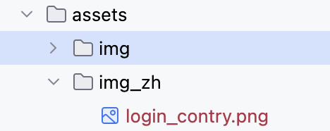

### 文本国际化

1. 在pubspec.yaml文件中添加依赖

```
dependencies:
  flutter:
    sdk: flutter
  flutter_localizations:
    sdk: flutter
  intl: any
```

执行flutter pub get加载依赖

2. 另外，在 pubspec.yaml 文件中，启用 generate 标志。该设置项添加在 pubspec 中 Flutter 部分，通常处在 pubspec 文件中后面的部分，与图片资源的配置平级

```
flutter:

  assets:
    - assets/
  #增加的nerate标志位置
  generate: true
```

3. 在项目根目录的Widget导入依赖并配置国际化代码

```
import 'package:flutter_localizations/flutter_localizations.dart';

---

return const MaterialApp(
  title: 'Localizations Sample App',
  //国际化配置START
  localizationsDelegates: [
    GlobalMaterialLocalizations.delegate,
    GlobalWidgetsLocalizations.delegate,
    GlobalCupertinoLocalizations.delegate,
  ],
  supportedLocales: [
    Locale('en'), // English
    Locale('es'), // Spanish
  ],
  //国际化配置END
  home: MyHomePage(),
);
```

4. 在 Flutter 项目的根目录中添加一个新的 yaml 文件，命名为 [l10n.yaml](https://docs.flutter.cn/ui/accessibility-and-internationalization/internationalization#configuring-the-l10n-yaml-file)，其内容如下：

```
arb-dir: lib/l10n
template-arb-file: app_en.arb
output-localization-file: app_localizations.dart
```

5. 在 ${FLUTTER_PROJECT}/lib/l10n 中，添加 app_en.arb 模板文件。如下：

```
{
  "helloWorld": "Hello World!",
  "@helloWorld": {
    "description": "The conventional newborn programmer greeting"
  }
}
```

6. 接下来，在同一目录中添加一个 app_es.arb 文件，对同一条信息做西班牙语的翻译：
```
{
    "helloWorld": "¡Hola Mundo!"
}
```

7. 现在，运行 **flutter run** 命令，你将在 ${FLUTTER_PROJECT}/.dart_tool/flutter_gen/gen_l10n 中看到生成的文件。同样的，你可以在应用没有运行的时候运行**flutter gen-l10n** 来生成本地化文件。

8. 在调用 MaterialApp 的构造函数时候，添加 import 语句，导入 app_localizations.dart 和 AppLocalizations.delegate。

```
import 'package:flutter_gen/gen_l10n/app_localizations.dart';
return const MaterialApp(
  title: 'Localizations Sample App',
  localizationsDelegates: [
    AppLocalizations.delegate, // 新增本地配置
    GlobalMaterialLocalizations.delegate,
    GlobalWidgetsLocalizations.delegate,
    GlobalCupertinoLocalizations.delegate,
  ],
  supportedLocales: [
    Locale('en'), // English
    Locale('es'), // Spanish
  ],
  home: MyHomePage(),
);

//或者使用下面方式自动生成

const MaterialApp(
  title: 'Localizations Sample App',
  localizationsDelegates: AppLocalizations.localizationsDelegates,
  supportedLocales: AppLocalizations.supportedLocales,
);
```

9. Material 应用启动后，你就可以在应用的任意地方使用 AppLocalizations 了:

```
appBar: AppBar(
  title: Text(AppLocalizations.of(context)!.helloWorld),
),
```

这样文本的国际化就配置完成了

10. 我们可以使用extension方式将该方法扩展到BuildContext中，这样我们就能直接从context中去拿国际化资源了

```
//扩展BuildContext
extension BuildContextExtension on BuildContext {
  AppLocalizations get l10n => AppLocalizations.of(this)!;
}

//使用
context.l10n.helloWorld
```

11. iOS 本地化：更新 iOS app bundle

```
1. 打开项目的 ios/Runner.xcodeproj Xcode 文件。

2. 在 Project Navigator 中，选择 Projects 下的 Runner 项目文件。

3. 在项目编辑器中选择 Info 选项卡。

4. 在 Localizations 部分，单击 添加 按钮 (+)，将支持的语言和地区添加到项目中。当要求选择文件和参考语言时，只需选择 Finish 即可。

5. Xcode 会自动创建空的 .strings 文件并更新 ios/Runner.xcodeproj/project.pbxproj 文件。 App Store 会使用这些文件来确定应用支持哪些语言和地区。
```

12. 其他国际化方法见[链接](https://docs.flutter.cn/ui/accessibility-and-internationalization/internationalization#an-alternative-class-for-the-apps-localized-resources)

### 图片国际化

1. 将需要国际化的图片放到指定目录，比如assets/img/目录下，该目录作为默认目录
2. 然后创建需要支持国际化资源的文件夹，比如中文资源assets/img_zh/，把这个国家的资源放到这个目录下
3. 创建工具类，获取以assets/img开头目录下的所有资源，存入本地list
4. 使用extension函数扩张出l10n方法
5. 然后在使用资源的位置通过.l10n 使用国际化资源

如下：


ResourceLocalUtil代码工具类如下：

```
import 'dart:async';
import 'dart:convert';
import 'dart:ui';

import 'package:blackproject/utils/utils.dart';
import 'package:flutter/cupertino.dart';
import 'package:flutter/services.dart';


List<String> assetPaths = [];
class ResourceLocalUtil{
  static Future initLocalRes() async {
    final assetBundle = rootBundle;
    final manifestContent = await assetBundle.loadString('AssetManifest.json');
    final Map<String, dynamic> manifestMap = json.decode(manifestContent);
    manifestMap.keys.where((String key) {
      bool isLocalImage = key.contains('assets/img');
      if(isLocalImage){
        // print('localImg:$key');
        assetPaths.add(key);
      }
      return isLocalImage;
    }).toList();
  }
}
extension AssetsIntlExtension on String {
  ///判断如果某张图片有对应的国际化图片，使用国际化图片，否则使用原图
  String get l10n {
    Locale myLocale = Localizations.localeOf(globalContext.currentContext!);
    String path = replaceAll("assets/img", "assets/img_${myLocale.languageCode.toLowerCase()}");
    // print('localImg path:$path');
    if (assetPaths.contains(path)) {
      // print('localImg path11:$path');
      return path;
    } else {
      return this;
    }
  }
}
```

在main入口初始化

```
void main() async {
  await ResourceLocalUtil.initLocalRes();//增加这行
  
  runApp(MyApp());
}
```

如何使用？

```
Image(
   image: AssetImage("assets/img/login_contry.png".l10n),//使用l10n国际化
   width: 32.0
)
```

> 参考链接：
> 1. [Flutter应用里的国际化](https://docs.flutter.cn/ui/accessibility-and-internationalization/internationalization#localizing-for-ios-updating-the-ios-app-bundle)
> 1. [Flutter 国际化(二) - 图片](https://juejin.cn/post/7278245644262850621)