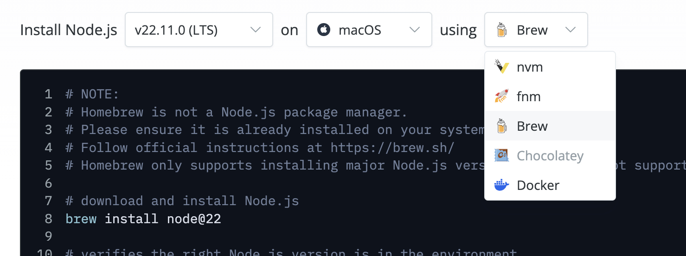

> npm是node.js的软件包管理器，我们在做Web开发或其他相关工作时，可能需要用到这个工具，那我们该如何搭建node环境呢

本文以Mac电脑作为示范，详细讲解npm的安装过程

### 1. 准备工作

在安装NPM之前，我们需要确保我们已经安装了以下软件:

1、Node.js：NPM是随Node.js一起发布的。如果没有安装Node.js，可以在[Node.js官网](https://nodejs.org/en/download/package-manager)下载。

2、Xcode命令行工具：可以在这里下载并安装Xcode命令行工具。

3、Homebrew：它是一个Mac OS X下的包管理器，可以在Homebrew官网上找到详细的安装说明。

安装完成后，可以运行以下命令检查是否成功安装了这些软件：

```
$ node -v
$ npm -v
$ brew -v
```

如果顺利地输出了版本信息，则表明这些软件已经成功安装。


### 2. 安装npm

在mac上安装npm有很多种方法，如下图官网所示：



本文使用brew的安装方式，在终端输入如下命令：
```
@后跟版本号，若跟的是大版本，则更新到对应大版本最新的小版本
brew install node@22
```

安装完成后，需要设置环境变量，在终端输入
```
vim ~/.zshrc
```

打开.zshrc文件后，按o键，在文件中新插入一行
```
#注意node@22这里可能会变，根据版本不同，这里会有点区别
export PATH="/usr/local/opt/node@22/bin:$PATH"
```

按住"shift+:"，输入wq，退出编辑，然后在终端输入

```
source ~/.zshrc
```

刷新配置文件，然后分别在终端输入以下命令：

```
$ node -v
$ npm -v
```

能出现对应的版本，则说明安装成功

### 3. 设置国内镜像源

如果这时候你通过npm去下载软件包，会发现很慢或者访问超时，那是因为国内网络访问github等一些国外的网站受到了限制，所以这里我们可以通过设置国内镜像的方式，如下

```
npm config set registry https://registry.npmmirror.com
```

或者[科学上网](../科学上网.md)

### 4. 更新npm

npm用了一段时间后有问题或者有些依赖需要高版本才能支持，那我们就需要更新npm版本，这里介绍两种方式

方式一：通过npm自身更新

```
npm install -g npm
```

方式二：通过Homebrew更新

```
brew update
brew upgrade node
```


### 5. 卸载npm

不用了，放着占地方，或者系统出错了，需要重新安装npm，这时候我们就需要先卸载掉npm，可以通过下面命令来卸载

```
brew uninstall node
或
npm uninstall npm -g
删除相关依赖
sudo rm -rf /usr/local/{lib/node{,/.npm,_modules},bin,share/man}/{npm*,node*,man1/node*}
```