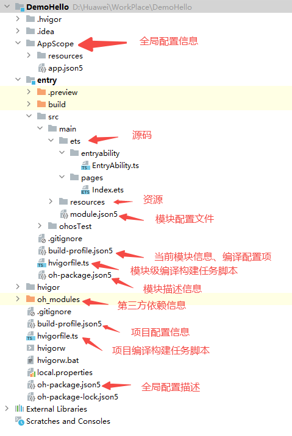

### 鸿蒙工程目录结构介绍(Stage模型)

如下图，我们来对鸿蒙工程做一个初步认识：



- AppScope > app.json5：应用的全局配置信息，详见app.json5配置文件。
- entry：HarmonyOS工程模块，编译构建生成一个HAP包。
	* src > main > ets：用于存放ArkTS源码。
	* src > main > ets > entryability：应用/服务的入口。
	* src > main > ets > entrybackupability：应用提供扩展的备份恢复能力。
	* src > main > ets > pages：应用/服务包含的页面。
	* src > main > resources：用于存放应用/服务所用到的资源文件，如图形、多媒体、字符串、布局文件等。关于资源文件，详见资源分类与访问。
	* src > main > module.json5：模块配置文件。主要包含HAP包的配置信息、应用/服务在具体设备上的配置信息以及应用/服务的全局配置信息。具体的配置文件说明，详见module.json5配置文件。
	* build-profile.json5：当前的模块信息 、编译信息配置项，包括buildOption、targets配置等。
	* hvigorfile.ts：模块级编译构建任务脚本。
	* obfuscation-rules.txt：混淆规则文件。混淆开启后，在使用Release模式进行编译时，会对代码进行编译、混淆及压缩处理，保护代码资产。详见开启代码混淆。
	* oh-package.json5：用来描述包名、版本、入口文件（类型声明文件）和依赖项等信息。
- oh_modules：用于存放三方库依赖信息。
- build-profile.json5：工程级配置信息，包括签名signingConfigs、产品配置products等。其中products中可配置当前运行环境，默认为HarmonyOS。

- hvigorfile.ts：工程级编译构建任务脚本。

- oh-package.json5：主要用来描述全局配置，如：依赖覆盖（overrides）、依赖关系重写（overrideDependencyMap）和参数化配置（parameterFile）等。

接下来我们通过页面的跳转来对上面的配置做一个初步认识和使用

### 页面跳转实现

1. 在src > main > ets > pages 目录下新建第二个页面：Second.ets
2. 在src > main > resources > base > profile 目录下，找到main_pages.json文件，将第二个页面的路由添加进去

```
{
  "src": [
    "pages/Index",
    "pages/Second"
  ]
}

```
3. 参照第一个页面，在第二个页面添加文本和按钮，并设置对应样式

```
//Second.ets
import router from '@ohos.router'
@Entry
@Component
struct Index {
  @State message: string = '我是第二个页面'

  build() {
    Row() {
      Column() {
        Text(this.message)
          .fontSize(50)
          .fontWeight(FontWeight.Bold)
        //添加按钮并增加点击事件
        Button(){
          Text("Back to first").fontSize(30).fontWeight(FontWeight.Bold).fontColor('#ffffff')
        }
        .type(ButtonType.Capsule).backgroundColor('#368fff').width(200).height(50)
        .margin({
          top:20
        }).onClick(() => {
          //todo 返回第一个页面
          router.back()
        })
      }
      .width('100%')
    }
    .height('100%')
  }
}
```

4. 在之前的HelloWorld程序页面中增加一个按钮，并增加点击事件；通过页面路由实现页面跳转

```
//Index.ets
import router from '@ohos.router'
@Entry
@Component
struct Index {
  @State message: string = 'Hello World'

  build() {
    Row() {
      Column() {
        Text(this.message)
          .fontSize(50)
          .fontWeight(FontWeight.Bold)
        //添加按钮并增加点击事件
        Button(){
          Text("Next Page").fontSize(30).fontWeight(FontWeight.Bold).fontColor('#ffffff')
        }
        .type(ButtonType.Capsule).backgroundColor('#368fff').width(200).height(50)
        .margin({
          top:20
        }).onClick(() => {
          console.log('button click to second page')
          //todo 跳转第二个页面
          router.pushUrl({url:'pages/Second'}).then(()=>{
            console.info('page jump succ')
          }).catch((err) => {
            console.error(`failed to jump to second page with:${err.code}, msg is ${err.message}`)
          })
        })
      }
      .width('100%')
    }
    .height('100%')
  }
}
```

通过上面的案例，我们知道了如何配置**路由**

下一节，我们将来介绍鸿蒙有哪些UI组件~~~