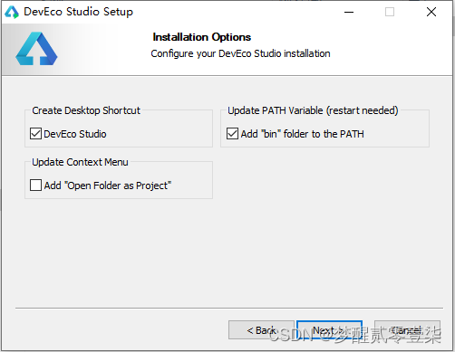
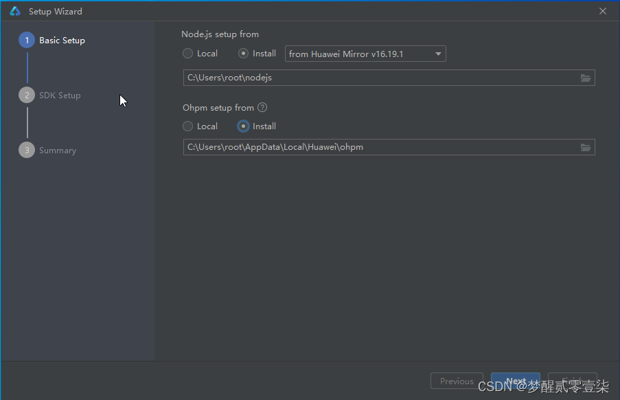
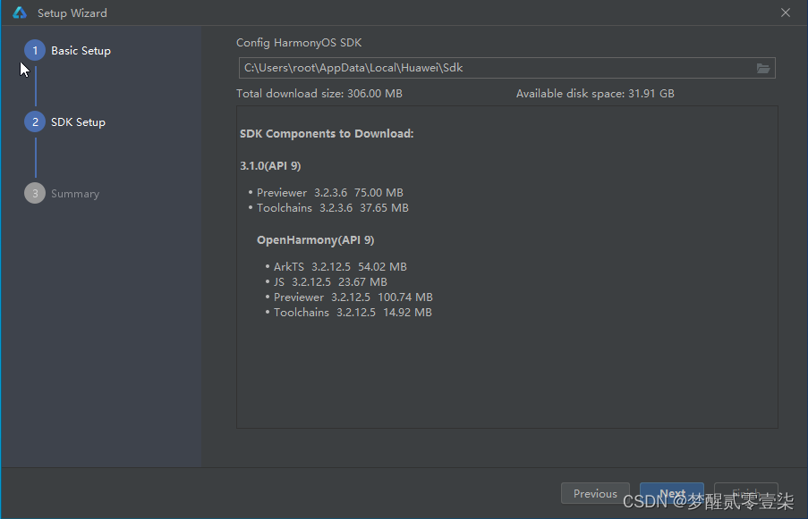
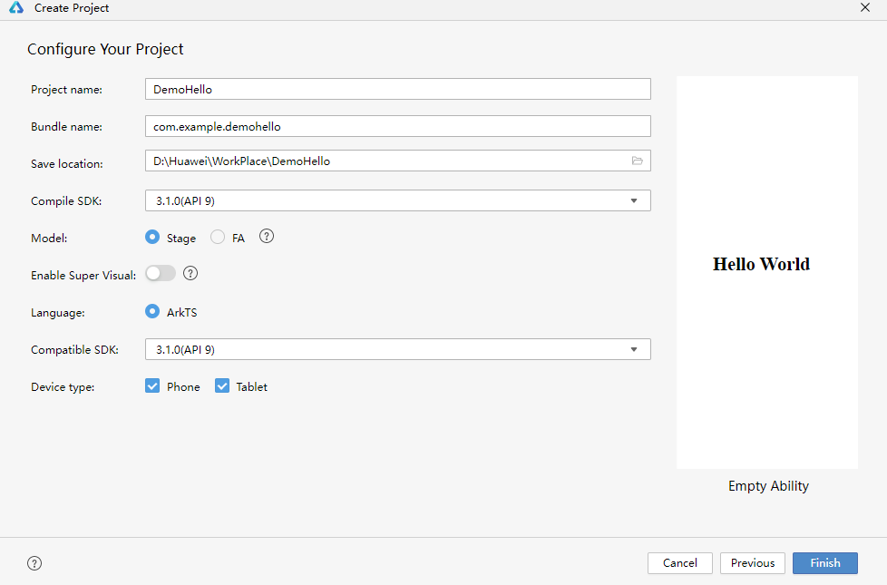
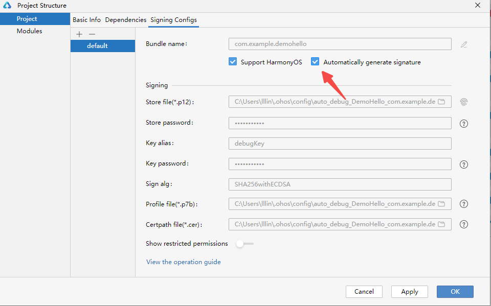
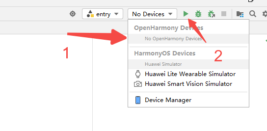

### 环境搭建
	
1. 配置HDC工具环境变量

	HDC是为开发者提供HarmonyOS应用/服务的调试工具，为方便使用HDC工具，请为HDC端口号设置环境变量。
	
	类似Java环境变量，在 **此电脑>属性>高级系统属性>高级>环境变量**中，添加变量名为：HDC_SERVER_PORT，变量值可以为任意未被使用的端口，如7035
	

2. 开发工具[DevEco Studio](https://developer.huawei.com/consumer/cn/deveco-studio/)下载
	
	更多版本请参考[HarmonyOS 3.1/4.0及以下](https://developer.huawei.com/consumer/cn/deveco-studio/archive/)
	
3. 下载完后，双击运行安装，在安装过程中选择创建桌面快捷方式和将bin目录添加到PATH环境变量，如下图：



4. 安装完成后，重启电脑，并双击桌面"**DevEco Studio**"图标，运行开发工具；
5. 根据引导安装Node.js与ohpm，如果已经存在，则可以指定本地已存在的路径，如下：



6. 在SDK Setup面板下，选择SDK存储路径并点击下一步



7. 然后一直点击Next，等待上述环境下载安装完毕后，单击Finish，完成环境的搭建

### 第一个程序Hello World

1. 点击File>New>Create Project，选择Empty Ability，点击Next，创建项目；
2. 填写项目相关信息，点击Finish，完成项目创建；
	


3. 等待工程下载依赖并同步完毕；
4. 配置签名，如下图：



如果不配置直接运行，则会出现如下错误

```
No signature is configured. Configure a signature by referring to the following link.
```

5. 运行，选择一个设备，模拟器或真机都行，让你绿色三角按钮



6. 在模拟器上查看效果

