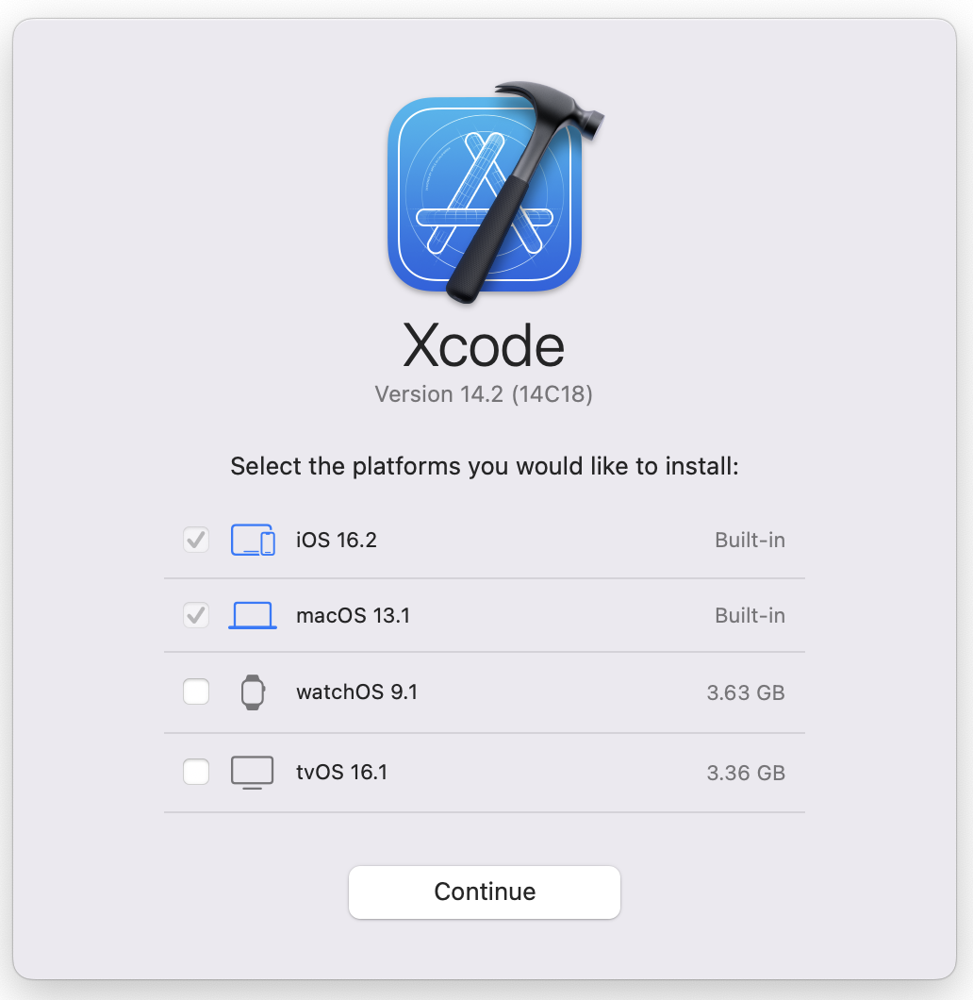

### mac搭建ios开发环境<!-- {docsify-ignore-all} --> 

#### 开发依赖

1. xcode(Ios sdk)
2. CocoaPods

#### xcode安装

1. 通过 App Store 搜索或是到 [Apple 开发者官网](https://developer.apple.com/xcode/)下载
2. 安装 Xcode 后打开并安装 Apple SDK（完成后这一步骤会同时安装 Xcode IDE、Xcode 的命令行工具和 iOS 模拟器），如下图：



#### CocoaPod安装

1. 安装

```
sudo gem install cocoapods
# 或 
brew install cocoapods
# 或 使用国内镜像安装 推荐，不需要科学上网	
/bin/zsh -c "$(curl -fsSL https://gitee.com/cunkai/HomebrewCN/raw/master/Homebrew.sh)"
```

2. 启动

```
pod setup
```

3. 检查安装是否成功

```
pod --version
```

4. 搜索第三方库

```
pod search AFN
```

5. 更新，如果第4步搜索时搜不到，可以更新pod库

```
pod update
```

6. 卸载，这里介绍使用Homebrew安装的卸载方式，其他方式可参考：

```
//1. 检查 CocoaPods 是否通过 Homebrew 安装
brew list --formula | grep cocoapods
//2. 如果出现在列表中，则说明可以通过brew命令卸载
brew uninstall cocoapods
//3. 如果要彻底清楚，请使用下面命令
brew uninstall --force cocoapods
//4. 清理残留文件
brew cleanup
//5. 再次执行第一步，看是否卸载干净
brew list --formula | grep cocoapods
```


> 参考链接：[ios Homebrew 安装CocoaPods](https://juejin.cn/post/7302330573380796428)