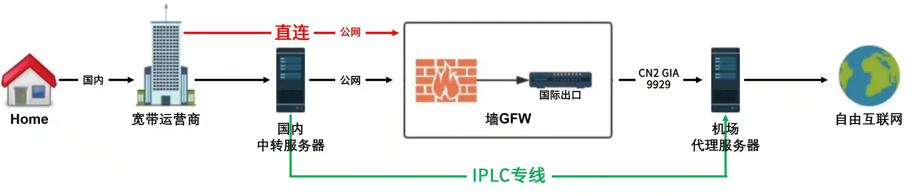

## 机场相关知识<!-- {docsify-ignore-all} --> 

我们在使用外网时，经常会碰到一些概念，其中主要的就是线路节点问题：直连节点、中转节点、IPLC节点；下面我们来介绍下这几个概念，如下图：

### 直连节点

直连节点，简单说就是数据直接出国经过墙GFW，走公网。如上图“红线”示意！

墙GFW是在不断升级的(再加上大数据识别)，你上外网数据流量一大，必然会被墙GFW进行特殊照顾(断流、掉线、封ip等)。就算我们使用的是最新技术v2ray或trojan+cdn+tls+ws也是不行的。因为这又回到了原点，无论怎么伪装，我们的数据最终还是要经过墙GFW，没有解决线路问题。

国内三大运营商国际线路中比较好的就是：163、CN2 GT、CN2 GIA、AS9929。综合网络延迟、链接速度和质量，结果是：CN2 GIA > AS9929 > CN2 GT > 163！可是，即使是最好的CN2 GIA线路，依然还是数据要经过墙GFW，所以根本线路问题没有解决！

### 中转节点<!-- {docsify-ignore} --> 

中转节点，只是“直连节点”的升级优化，多使用了1台国内中转服务器而已。如上图“黑线”示意！

这种一般叫做BGP中转节点，它通过在国内架设1台中转服务器进行“公网中转”，从而提升国内用户的访问速度与稳定性。但是，很遗憾的是，中转节点仍然数据经过墙GFW，没有解决线路问题！

### IPLC专线节点<!-- {docsify-ignore} --> 

IPLC专线节点，指的是点对点传输，内网专线直达，数据不经过墙GFW。如上图“绿线”示意！

比如常见的深港IPLC是指深圳到香港点对点传输，此线路不使用公网，不存在审查，也不存在运营商QoS。因为不挤公网，即使在高峰时期，速度与稳定性也杠杠的。

所以，最终哪种节点好呢，大家应该清楚了吧~~~

## 如何使用"机场"呢

1. 购买[第三方](../科学上网.md)的，这个最快捷，但是有些不良商家可能会收集你的个人信息，安全问题待考证。

2. 自己搭建，可以参考[v2board](https://github.com/v2board/v2board-docs)或其他的

> 参考链接
> 1. [奶油之家-机场搭建](https://naiyous.com/science-online/airport-construction)